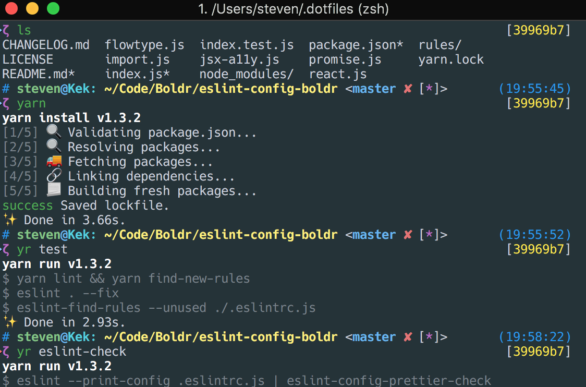

# dotfiles

All the cool kids have a dotfiles repo...      
     
I didn't and then wiped my laptop to install MacOS High Sierra. Now here we are still setting things up.

The `install.sh` file symlinks everything to the home directory. If the file already exists, it is renamed to `${file}_backup`. Running `_macos` sets up MacOS system overrides and defaults. 
       

### iTerm screenshot
      
